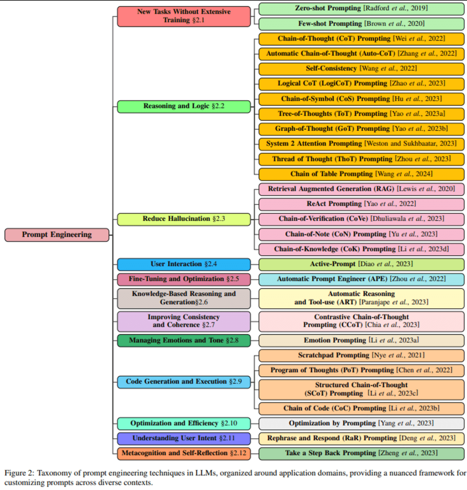
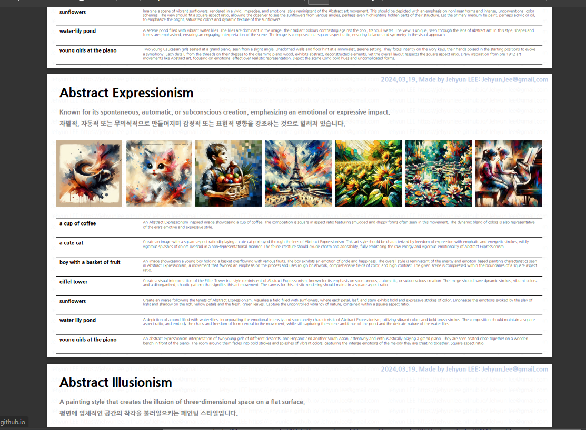

# 동화 생성 LLM 프롬프트

> 작성자 : [김이삭](https://github.com/Isak-toast)

Table of Contents

- [LLM 활용 이유](#llm-활용-이유)

---

## 동화 생성 프롬프트 과제
동화 생성은 단순한 텍스트 작성을 넘어서, 스토리텔링과 시각적 요소가 결합된 복합적인 창작 활동입니다. 이 과정에서 텍스트는 깊이 있는 스토리와 감정을 전달하는 역할을 하며, 이미지는 스토리를 보완하고 독자의 상상력을 자극하는 역할을 합니다.

## 텍스트 생성을 위한 프롬프트 엔지니어링 전략
[Unmet Creativity Support Needs in Computationally Supported Creative Writing](https://aclanthology.org/2022.in2writing-1.11.pdf)

LLM은 공동 창작 저자로서의 의미를 가지지만 아직은 많은 과제에 직면해 있다. 텍스트 부분에서 LLM을 활용하여 스토리텔링의 측면을 강화하기 위한 전략은 다음과 같습니다.

- maintaining narrative consistency (내러티브 일관성 유지)
- developing plot structure (플롯 구조 개발)
- architecting reader experience (독자 경험 설계)
- refining their expressive intent (표현 의도 개선)

내러티브 일관성 유지: 캐릭터의 성격, 설정의 배경 등 스토리의 모든 요소가 일관성을 유지하도록 프롬프트를 구성합니다.
플롯 구조 개발: 스토리의 시작, 전개, 절정, 결말을 포함하는 구조적 프롬프트를 활용하여 LLM이 체계적인 스토리라인을 생성하도록 합니다.
독자 경험 설계: 독자가 스토리를 통해 경험할 감정, 반전, 교훈 등을 명시하여, LLM이 독자에게 강렬한 인상을 남기는 콘텐츠를 생성하도록 유도합니다.
표현 의도 세밀화: 스토리를 통해 전달하고자 하는 메시지나 주제를 분명히 하여, LLM이 이를 반영한 스토리를 생성하도록 합니다.

### 최적화 매커니즘과 방법론(Methodology)
1. Transfer Learning and Fine-Tuning:
설명: 사전 훈련된 모델을 특정 작업에 맞게 추가로 훈련하는 방식입니다. 대규모 데이터셋으로 사전 훈련된 모델을 사용하여, 작은 양의 데이터로도 효과적인 학습이 가능합니다.

적용: BERT, GPT-3, RoBERTa와 같은 대규모 사전 훈련 모델을 활용하여 다양한 NLP 작업에 적용됩니다.
2. Knowledge Distillation:
설명: 큰 모델이나 앙상블 모델의 지식을 더 작은 모델로 전달하는 기법입니다. 이를 통해 작은 모델도 큰 모델의 성능을 모방할 수 있게 됩니다.
적용: 리소스 제약이 있는 환경에서 큰 모델의 성능을 필요로 할 때 유용합니다.

3. Meta-Learning:
설명: 다양한 작업에서 학습하는 방법을 학습하여, 새로운 작업에 빠르게 적응할 수 있는 모델을 만드는 기법입니다.
적용: 소규모 데이터셋이나 다양한 작업에 모델을 빠르게 적응시키고 싶을 때 적합합니다.

4. Adversarial Training:
설명: 모델의 일반화 능력을 향상시키기 위해, 적대적 예제를 사용하여 모델을 훈련시키는 기법입니다.
적용: 모델의 강인성을 높이고 싶을 때, 예를 들어 자연어 이해와 같은 작업에서 사용됩니다.

5. Prompt Tuning and Instruction Tuning:
설명: 최근에는 모델에 명시적인 지시문(prompt)을 주어 특정 작업을 수행하게 하는 기법이 인기를 끌고 있습니다. 이는 모델의 파라미터를 전체적으로 수정하는 대신, 입력 부분을 조정하여 효율적인 학습을 가능하게 합니다.
적용: GPT-3와 같은 대규모 언어 모델을 활용한 다양한 작업에서 사용됩니다.

6. Zero-shot and Few-shot Learning:
설명: 사전 훈련된 모델을 활용하여, 아예 훈련 데이터 없이(Zero-shot) 또는 극히 적은 데이터(Few-shot)로 특정 작업을 수행할 수 있게 하는 기법입니다.
적용: 데이터 획득이 어려운 작업이나 빠르게 프로토타이핑을 하고 싶을 때 유용합니다.

## 이미지 생성과 일관성 유지 방법
각 챕터별로 일관된 스타일과 연관성을 가진 이미지를 생성하기 위한 방법은 다음과 같습니다.

- 스타일 일관성: 이미지 생성에 사용될 LLM(예: DALL-E)에게 스타일 가이드를 제공하여, 전체 동화를 통틀어 일관된 비주얼 스타일을 유지하도록 합니다.
- 챕터 연관성: 각 챕터의 주요 요소와 테마를 반영하는 키워드를 이미지 생성 프롬프트에 포함시켜, 스토리와 이미지 간의 연결고리를 강화합니다.

스타일 시트를 통해서 일관성있게 구축되는지 확인해보자.

*스타일 시트에서 발췌한 이미지

### Electroacoustic Music Style
Electroacoustic Music 스타일의 "귀여운 고양이"

Electroacoustic Music 스타일의 "귀여운 강아지"

### Pseudorealism Style
Pseudorealism 스타일의 "귀여운 고양이"

Pseudorealism 스타일의 "귀여운 강아지"

## 향후 계획과 발전 방향
- LLM 파인튜닝: 텍스트 생성을 위한 LLM의 파인튜닝을 통해, 동화 특화 모델의 성능을 개선합니다.
- 프롬프트 엔지니어링 비교 연구: 다양한 프롬프트 엔지니어링 전략의 효과성을 비교 분석하여, 최적의 동화 생성 방법론을 개발합니다.
- 이미지 생성 기술 개발: 캐릭터 및 배경의 일관성을 유지하면서도 창의적인 이미지를 생성할 수 있는 기술에 대한 연구를 진행합니다.

### 📍부록 및 참고 자료

- [DALL-E style 가이드북](https://jehyunlee.github.io/2024/03/20/General-46-dalle3styles3/)
- [Meta-Learning](https://engineering-ladder.tistory.com/95)