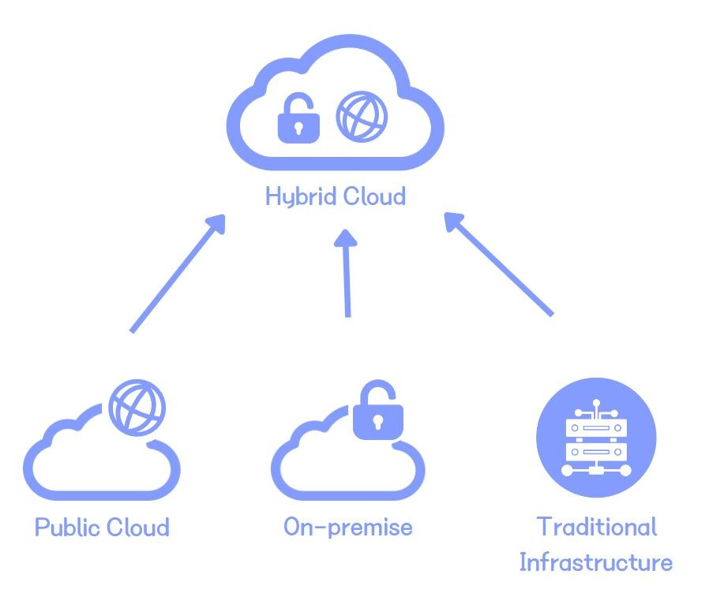
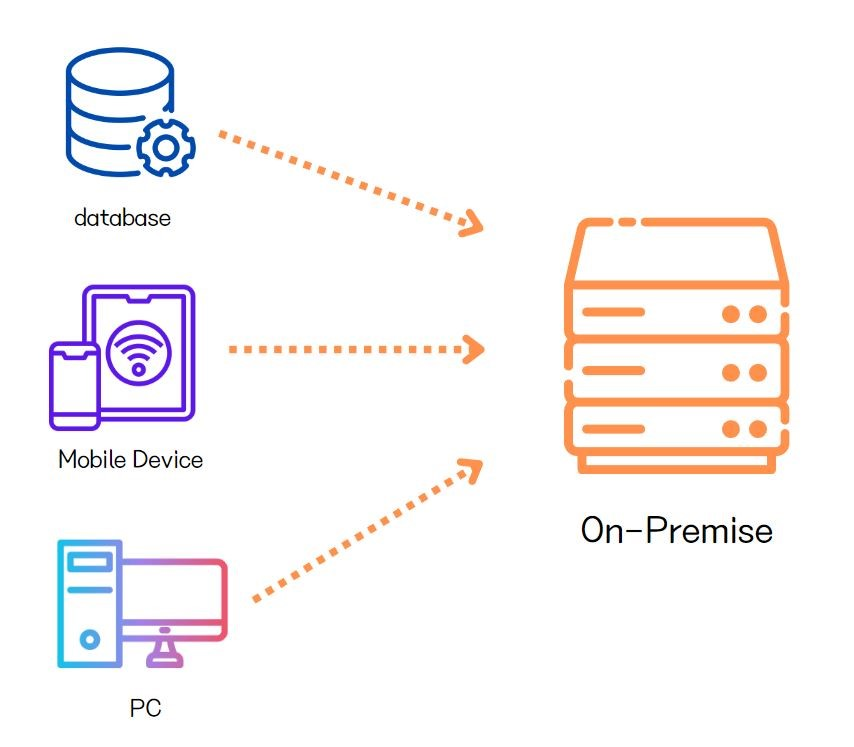

# Cloud computing

> 작성자 : [배소라] (https://github.com/sorayayat)

목차

- [클라우드 컴퓨팅 개요](#클라우드-컴퓨팅cloud-computing이란)
- [온-프레미스란](#온-프레미스-on-premise란)
- [온-프레미스 vs 클라우드 컴퓨팅(오프-프레미스)](#온-프레미스-vs-클라우드-컴퓨팅오프-프레미스)
- [클라우드 컴퓨팅 유형](#클라우드-컴퓨팅-유형)

## 클라우드 컴퓨팅(Cloud computing)이란

인터넷을 통해 원격으로 컴퓨팅 자원 및 서비스를 제공하는 컴퓨팅 기술입니다. 
물리적 서버, 가상 서버, 데이터 스토리지, 네트워킹 기능, 애플리케이션 개발 도구, 소프트웨어, AI 기반 분석 도구 등... 
컴퓨팅 리소스에 대한 주문형 액세스 입니다. 

 
 

## 온-프레미스 (On-premise)란

자체적으로 IT 인프라를 소유, 관리 및 운영하는 경우를 말합니다.
이 경우 사내 IT 팀이 설계, 구축 및 관리를 담당합니다. 드물지만 서드 파티 공급업체가 일부 구성요소를 관리 하는 경우도 있습니다. 
그러나 대부분이 위치, 장치, 소프트웨어, 애플리케이션을 소유하고 관리합니다. 

 
 
 

## 온-프레미스 vs 클라우드 컴퓨팅(오프-프레미스)

|   | 온-프레미스 | 오프-프레미스 |
|---|---|---|
|관리|인프라의 엔드-투-엔드 실행과 관리를 전적으로 책임|서비스 공급 업체에서 인프라의 관리를 담당|
|소유/통제|인프라의 완전한 소유권을 가짐| 공급업체가 리소스 소유. 계약에 따라 인프라 사용 시설과 리소스에 대한 권한이 작다
|자본지출|인프라 전체를 구축해야 하므로 대규모 자본 지출이 요구됨| 대부분의 업체가 사용량 기반의 과금 모델을 제공
|비용|초기 비용 후 에너지, 유지보수 및 인력 비용을 지속해서 지출| 시설 및 리소스 유지를 업체와 기업이 공동 부담하는 형태로 구독 요금 및 정액을 통해 지불, 낮은 비용을 지불
|확장성|리소스가 구축되면 동적으로 변경하기 어려움 요구사항이 바뀌면 활용도가 낮아짐| 수요에 따라 확장 축소가 가능
|네트워킹|로컬 네트워크를 통해 인프라 접근으로 보안이 향상|인터넷을 통한 액세스만 가능 액세스가 이상적이지 않은 경우 안전한 프라이빗 네트워크 구축을 해야함
|보안|모든 애플리케이션의 보안을 책임. 전문가를 고용해야함| 공급업체에 책임이 있음 기업은 애플리케이션의 보안에만 책임
|패치,업데이트관리|내부적으로 결정을 내리고 즉시 실행 가능 자본 배분의 필요로 중단이 발생할수 있다.| 공급업체가 업데이트를 관리, 확장이 가능하다는 특성상 공급업체는 서비스 수준에 영항을 주지 않고 리소스를 업데이트 할 수 있다.

---

 

## 클라우드 컴퓨팅 유형

### 퍼블릭 클라우드

서비스 제공 업체가 SaaS 애플리케이션, 개별 가상머신(VM), **베어메탈 컴퓨팅** 하드웨어, 완전한 엔터프라이즈급 인프라, 개발 플랫폼 등의 컴퓨팅 리소스를 사용자에게 공개적으로 제공하는 클라우드 컴퓨팅 유형입니다. 인터넷. 이러한 리소스는 무료로 액세스할 수 있거나 구독 기반 또는 종량제 가격 책정 모델에 따라 액세스할 수 있습니다.

> 베어메탈 컴퓨팅? - ‘베어메탈(Bare Metal)’이란 용어는 원래 하드웨어 상에 어떤 소프트웨어도 설치되어 있지 않은 상태를 뜻합니다. 즉, 베어메탈 서버는 가상화를 위한 하이퍼바이저 OS 없이 물리 서버를 그대로 제공하는 것을 말합니다. 따라서 하드웨어에 대한 직접 제어 및 OS 설정까지 가능합니다.

### 프라이빗 클라우드

프라이빗 클라우드는 모든 클라우드 인프라와 컴퓨팅 리소스가 한 고객에게만 집중되는 클라우드 환경입니다. 
프라이빗 클라우드는 탄력성, 확장성, 서비스 제공 용이성 등 클라우드 컴퓨팅의 다양한 이점을 온프레미스 인프라의 액세스 제어, 보안 및 리소스 맞춤화와 결합합니다.

### 하이브리드 클라우드

하이브리드 클라우드 는 말 그대로 퍼블릭 클라우드, 프라이빗 클라우드, 온프레미스 환경의 조합입니다. 구체적으로(그리고 이상적으로) 하이브리드 클라우드는 조직의 애플리케이션과 워크로드를 실행하기 위해 이러한 세 가지 환경의 조합을 유연한 단일 인프라로 연결합니다. 