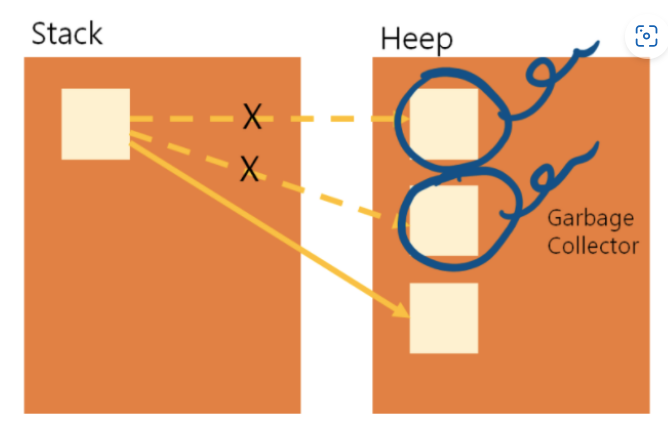
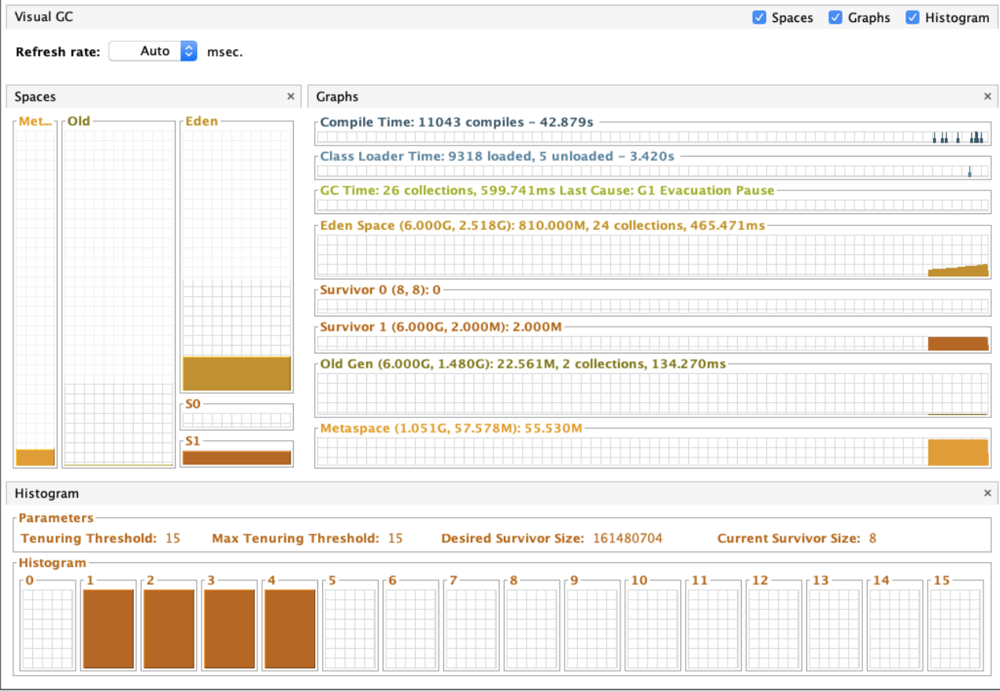
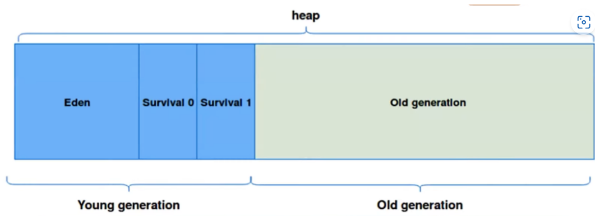
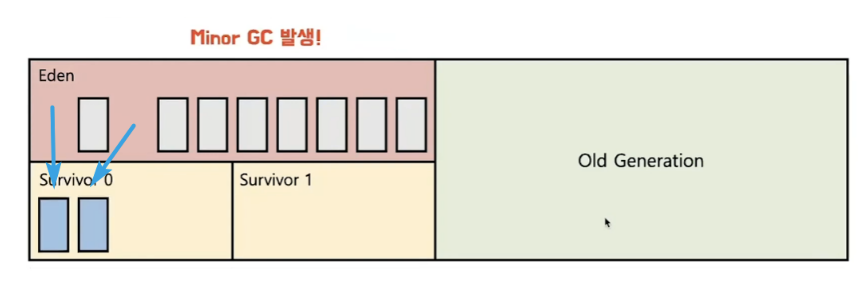

# Garbage Collection

> 작성자 : [장성근](https://github.com/heoap9)

<details>
<summary>Table of Contents</summary>

- [GC?](#GC)
- [Java 성능프로파일링](#java-성능-프로파일링-)
- [GC동작 구조 및 heap영역](#heap영역의-관리-및-gc)
</details>

---

## GC
**Garbage Collection** 은 메모리 관리 방법 중 하나로 자바에서는 JVM의 Heap영역에서  
동적으로 할당했던 메모리 중 필요없게 된 메모리 객체를 모아 주기적으로 제거하는 프로세스를 말합니다

  
객체가 할당되고 Reference타입의 변수가 이를 참조하고 있지 않은 경우  
GC의 동작 구조에 따라 이 객체의 유효시점을 검증하여 메모리영역에서 객체를 해제하여 메모리를 확보합니다  
이런 특성을 가지기 때문에 GC를 서비스나 프로그램 환경에 따라 맞게 최적화 해주는 과정이  
숙련된 개발자의 숙제가 된다  
**이러한 과정을 GC튜닝이라 부른다!**

## Java 성능 프로파일링  
자바의 특성 상 시스템 메모리에 가상환경을 통해 구동되기 때문에 이 성능 프로파일링을 진행하기 앞서  
모니터링을 진행해야 하는데 Java는 이 모니터링을 하기 위한 클래스를 기본적으로 제공한다  

```java
// 타겟 VM에 연결
VirtualMachine vm = VirtualMachine.attach("2177");

// 관리 에이전트 시작
Properties props = new Properties();
props.put("com.sun.management.jmxremote.port", "5000");
vm.startManagementAgent(props);

// 연결 해제
vm.detach();
```  

자바는 공식적으로 이 VM클래스를 제공하며 별도의 jvm을 구축하여 이 성능에 대한 모니터링을 진행할 수 있으며  
이 성능 모니터링 도구에 따라 현재 구동환경을 바라보는 지향점은 달라지게 된다  





## Heap영역의 관리 및 GC



- eden
    - new 를 통해 새로 생성된 객체가 위치함
    - 정기적인 GC후 살아남은 객체는 Survival 영역으로 보냄

- survivor0/survivor1
  - 최소 1번의 gc이상 살아남은 객체가 존재하는 영역
  - survivor영역에는 특별한 규칙이 있는데 이 survivor0또는 survivor1 둘중 하나는 꼭 비어있어야 함

이렇게 하나의 힙 영역에서 세부적으로 쪼갬으로 객체의 생존기간을 면밀하게 제어하여
GC를 보다 정확하게 불필요한 객체를 프로세서화 되어있음  


  
  
이러한 eden 영역이 다 차게 되는경우 Minor Gc가 실행되어
사용되고있는 객체는 survivor 영역으로 이동됨

그리고 이 살아남은 모든객체는 age값이 증가하여 다른영역으로 이동 하기 전 기록하는 용도가 된다

  

GC는 이러한 과정을 계속 반복하여 minor GC를 거치게 된다  

  

survivor 영역에서 살아남은 객체는 살아남은 주기에 따라 old gen 영역으로 이동하게 되며
이 영역이 가득 차게 될 시에 major gc를 실행하게 된다

하지만 old Gen은 young gen에 비해 상대적으로 큰 공간을 가지고 있어
이 공간에서의 메모리 객체 제거에 많은 시간이 걸리게 된다
young 영역은 일반적으로 old영역보다 크기가 작아 약 0.5~1초정도의 시간에서 처리되지만
major gc는 일반적으로 minor gc보다 시간이 오래걸리며 10배 이상의 시간을 사용한다


**Major GC가 일어나면 Thread가 멈추고 Mark and sweep작업을 해야 해서 cpu에 부하를 주기때문에 멈추거나 버벅이는현상이 일어나게 된다** 
