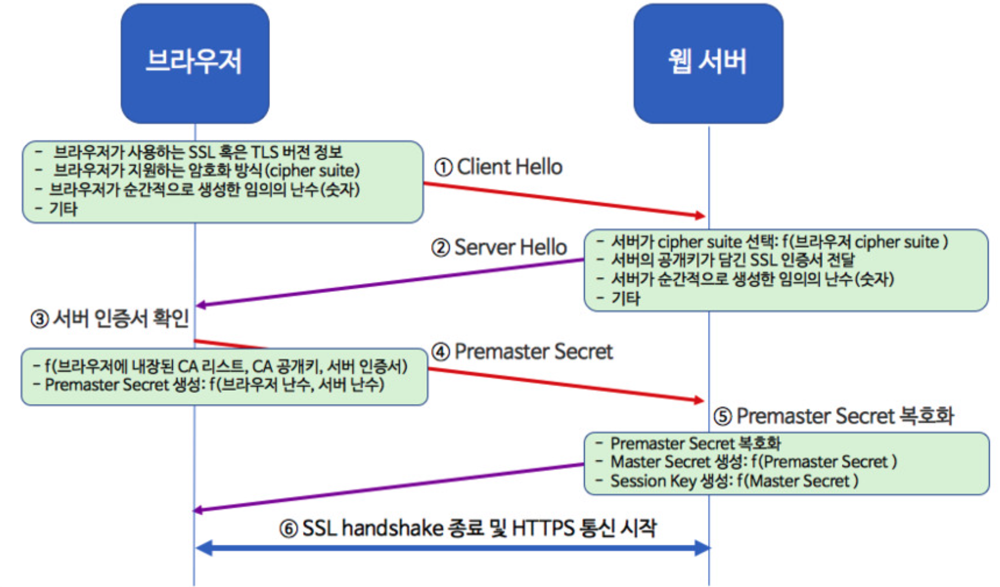

# SSL

> 작성자 : [배소라] (https://github.com/sorayayat)

목차

- [암호학](#간단한-암호학)
- [SSL이란?](#ssl-이란)
- [SSL 보안 과정](#ssl-보안-과정)

---

## 간단한 암호학!

평문 (cleartext = plaintext)

- 데이터 정보를 가지고 있는 원본 입니다.

암호문 (ciphertext)

- 내용을 제3자가 판독 할 수 없는 글자, 숫자, 부호 등으로 변경 시킨 것 입니다.

암호화 (encryption)

- 평문을 암호문으로 변경하는 것 입니다.

복호화(decryption)

- 암호문을 평문으로 변경하는 것 입니다.

 
 
 

|방향|종류|의미|
|---|---|---|
|단방향|Hash|암호화만 수행|
|양방향|대칭|암/복호화에 사용 되는 키가 동일
||비대칭|암/복호화에 사용 되는 키가 한 쌍으로 다른 키가 사용 됨
||Hybrid|키 교환은 비대칭 암호화, 데이터 전달은 대칭 암호화

## SSL 이란?

SSL(Secure Socket Layer) 프로토콜은 **웹서버(서버)와 브라우저(클라이언트) 사이의 보안**을 위해 만들었습니다.

SSL은 서버와 클라이언트의 인증을 하는데 사용됩니다.
HTTPS와 같이 443 port를 사용하여 통신 데이터가 암호화되어 가로채려는 3자로부터 데이터를 지켜 낼 수 있습니다.

---

 
 

### SSL 보안 과정

1) ***[웹브라우저(클라이언트)]***

SSL로 암호화된 페이지를 요청하게 된다.     // 일반적으로 https:가 사용된다.

2) **[웹서버(서버)]**

Public Key 를 인증서와 함께 전송한다.

3. ***[웹브라우저(클라이언트)]***

인증서가 자신이 신용있다고 판단한 CA로부터 서명된 것인지 확인한다. 또한 날짜가 유효한지, 그리고 인증서가 접속하려는 사이트와 관련되어 있는지 확인한다.

4. ***[웹브라우저(클라이언트)]***

Public Key를 사용해서 랜덤 대칭 암호화키를 비롯한 URL, http 데이터들을 암호화해서 전송한다.

5. **[웹서버(서버)]**

Private Key를 이용해서 랜덤 대칭 암호화키와 URL, http 데이터를 복호화한다.

6. **[웹서버(서버)]**

요청받은 URL에 대한 응답을 웹브라우저로부터 받은 랜덤 대칭 암호화키를 이용하여 암호화해서 브라우저로 전송한다.

7. **[웹브라우저(클라이언트)]**

대칭키를 이용해서 http 데이터와 html 문서를 복호화하고, 화면에 정보를 뿌려준다. 

 
 

SSL 인증서 과정에는 대칭키 방식과 공개키 방식 두개 모두 사용되었습니다.

모든 웹 콘텐츠의 전달을 공개키 방식으로 한다면 웹 서버와 브라우저에 많은 부담이 되기 때문에 SSL Handshake 단계까지는 공개키 방식, 이 후 HTTPS 통신은 대칭키 방식을 사용하는 것 입니다.

openssl, wireshark를 통해서 통신 내용을 확인 할 수 있습니다.!

 
 

>참고자료  
SSL 과정
https://brunch.co.kr/@sangjinkang/38  
암호학
https://velog.io/@security_code/SSLTLS