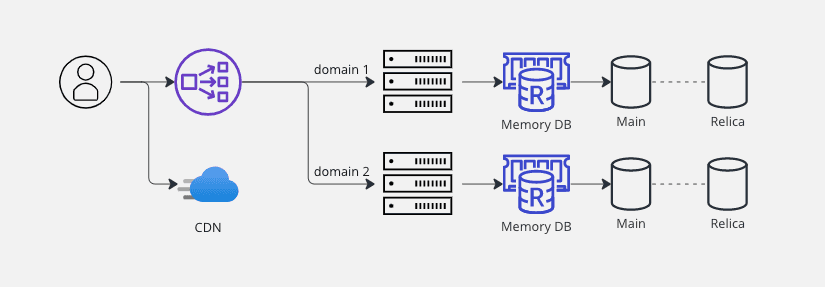

# 대규모 트래픽 처리

> 작성자 : [배소라] (https://github.com/sorayayat)

목차

- [대규모 웹 서비스](#대규모-웹-서비스-개발)
- [대규모 트래픽의 기준?!](#대규모-트래픽을-판단할-때-고려해야-할-항목)
- [처리 방법](#처리-방법)

---

## 대규모 웹 서비스 개발

- 대규모 트래픽이 있을 수 있고, 대규모 데이터가 있을 수 있고, 둘 다 있을 수 있다. 
- 트래픽이나 저장된 데이터의 용량이 일정 기준을 넘었냐가 기준이 아니다. 

1) 로드밸런싱 하는 하드웨어나 소프트 웨어 설정이 필요한 환경의 트래픽
2) 서버 1대로 원활한 서비스를 제공할 수 없어 스케일아웃(scale-out)이 필요한 경우
등등... 의 여러 의견으로 갈린다. 
(면접 tip으로는 까이지 않도록 그냥 수치로 제시하라는 의견도 있었다.)

### 대규모 트래픽을 판단할 때 고려해야 할 항목

**동시 접속자 수(Concurrent Users)**
서비스에 동시에 접속하는 사용자 수를 의미, 대용량 트래픽이 발생 한다. 
일반적으로 100,000개 이상의 동시 연결을 지원해야 할 경우를 말한다. 

**요청량(Request Rate)**
API 서버에 들어오는 HTTP 요청 수를 나타낸다. 
일반적으로 1초당 1,000개 이상의 요청을 처리해야하는 경우를 말하며 성능 목표는 초당 최소 1000개의 요청 처리이다. 

**데이터 전송량(Data Tramsfer)**
대용량 트래픽은 사용자들이 업로드 및 다운로드하는 데이터 양에 따라 판단 될 수 있다. 
일반적으로 1초당 10MB 이상의 데이터를 처리해야 하는 경우이다. 

**요청에 대한 응답 시간(Response Time)**
API 서버가 요청을 처리하는데 걸리는 시간을 말한다. 이상적인 응답 시간은 100밀리초 미만을 유지하는 것 이다. 

**서버 리소스 사용률(Server Resour Utilization)**
서버의 CPU, 메모리, 디스크 공간 등의 리소스 사용률을 모니터링 해야한다. 
충분한 서버 리소스가 필요하기 때문에 리소스가 포화 되어서는 안된다. 

### 처리 방법

1. 스케일링 전략 : 서버의 자원을 증가시키는 수직적, 서버 수를 늘리거나 줄이는 수평적

2. 분산 시스템 : 서버를 여러개로 분산하여 트래픽을 분산 (클러스터링)

3. 로드 밸런싱 : 로드 밸런서가 여러 개의 서버에 부하는 분산하여 서버 장애를 방지

4. 캐싱 : 반복적으로 사용되는 데이터나 결과를 메모리에 저장하여 빠르게 액세스

5. 레이어링 : 시스템을 여러 개의 레이어로 분리하여 각 레이어의 기능을 분담

## 시스템 설계

시스템을 오픈하고 사용자가 늘어감에 따라 인프로 구조가 변해가는 과정을 예시로 보자 

- 서비스 오픈  
 

 

- 사용자 증가  
  

 

- 수직적 확장의 한계 -> 스케일 아웃  
  

로드 밸런서 추가되어 여러 대의 WAS에 골고루 트래픽을 분산 처리

 

- Database 이중화  
  

시스템에서 부하를 가장 많이 받는 곳은 I/O 가 발생하는 Database 지점이 된다.
Database은 확장 방법 중 하나인 Replication을 활용하여 Main 과 Replica로 나누고, CUD는 Main db로, R 은 Sub로 한다. 
(master, slave 대신에 main, replica로 용어를 사용한다.)

 

- static 파일의 분리  
 

프론트 앤드 코드 파일이나 이미지 파일 등 정적 파일을 AWS cloudfront 등을 이용해 서비스 할 수 있다.  

 

- Memory DB  
  

DB는 사이에 memory db (Redis) 캐싱을 통해 속도를 증가

- MSA로의 전환  
  

WAS를 분리 할 수 있다. 도메인 별이나 하위 도메인으로 서버를 분리하고 본인의 DB를 사용한다.  

참고
https://kyungyeon.dev/posts/96