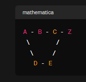

# 응용 알고리즘
> 작성자 : [김이삭](https://github.com/Isak-toast)

<details>
<summary>Table of Contents</summary>

- [다이나믹 프로그래밍 (Dynamic Programming)](#다이나믹-프로그래밍-dynamic-programming)
- [그리디 알고리즘 (Greedy Algorithm)](#그리디-알고리즘-greedy-algorithm)
- [분할 정복 알고리즘 (Divide and Conquer)](#분할-정복-알고리즘-divide-and-conquer)
- [백트래킹 (Backtracking)](#백트래킹-backtracking)
- [그래프 알고리즘 (Graph Algorithm)](#그래프-알고리즘-graph-algorithm)
- [부록 및 참고 자료](#부록-및-참고-자료)

</details>

---
## 개요
**정의**
응용 알고리즘은 특정한 응용 분야나 고급 문제를 해결하기 위해 설계된 알고리즘입니다. 이들은 보통 기본 알고리즘을 기반으로 하면서, 특정 문제에 최적화되거나 특수한 기술을 사용하여 개발됩니다.

**예시**
기계 학습 알고리즘, 그래프 알고리즘(최단 경로, 최소 신장 트리), 암호화 알고리즘 등이 응용 알고리즘의 예입니다.

**목적**
응용 알고리즘은 특정 분야의 복잡한 문제를 해결하거나, 성능을 최적화하기 위해 사용됩니다. 이들은 종종 특화된 지식이나 기술을 필요로 하며, 실세계의 복잡한 시나리오에 적용됩니다.

### 문제 예시

경로 찾기: GPS 시스템에서 최적의 경로를 계산할 때 사용됩니다. 여러 경로 중 시간이나 거리가 가장 적게 드는 경로를 찾아내는 데 _______이 활용될 수 있습니다.


자원 할당: 프로젝트 관리에서 제한된 자원(예: 시간, 인력, 예산)을 가장 효율적으로 사용하기 위한 결정을 내릴 때 _______을 사용할 수 있습니다.


정렬 알고리즘: 컴퓨터에서 파일이나 데이터를 정렬할 때, 병합 정렬과 같은 _____ 알고리즘이 사용됩니다. 이는 데이터를 작은 단위로 나누고, 각각을 정렬한 다음 병합하는 과정을 통해 전체를 정렬합니다.


퍼즐 해결: 스도쿠나 크로스워드 퍼즐 같은 게임에서 모든 가능성을 탐색하면서 해결책을 찾아가는 과정에서 _______이 사용됩니다. 잘못된 선택을 하게 되면 이전 단계로 돌아가 다른 선택을 시도합니다.


소셜 네트워킹: 소셜 미디어 플랫폼에서 친구 추천 시스템이나 네트워크 내에서의 최단 연결 경로를 찾는 데 _______이 사용됩니다. 사용자 간의 관계를 그래프로 모델링하여 분석할 수 있습니다.


## 소개
### 다이나믹 프로그래밍 (Dynamic Programming)


#### 배경
다이나믹 프로그래밍은 복잡한 문제를 간단한 하위 문제로 나누어 해결하는 방법입니다. 이 접근법은 1950년대에 리처드 벨만에 의해 개발되었으며, '다이나믹'이라는 용어는 시간에 따라 시스템의 상태가 변화하는 과정을 나타내는 데에서 유래했습니다.
시간 복잡도가 비효율적인 알고리즘의 부분 문제의 반복이 발생하는 경우에 사용됩니다. 이는 메모리를 더 사용하여 시간 복잡도를 개선하는 방법으로, 큰 문제를 유사한 형태의 작은 문제로 나누어 해결하고, 작은 문제의 답을 모아 큰 문제를 해결합니다

<details>
<summary>다이나믹 프로그래밍이란?</summary>
다이나믹 프로그래밍(Dynamic Programming)이라는 이름은 이 알고리즘의 창시자인 Richard Bellman이 붙였습니다. 그는 이 용어를 선택한 이유에 대해 명확하게 설명하지 않았지만, 그의 자서전에서 다음과 같이 언급했습니다:

“다이나믹 프로그래밍이라는 용어는 다양한 상황에서 사용할 수 있으며, 특히나 나는 이 용어가 멋있어 보이고, 내 연구에 정치적인 차원을 추가할 수 있다고 생각했습니다.”

즉, "다이나믹 프로그래밍"이라는 이름은 그의 연구에 대한 관심을 끌기 위해 선택된 것으로 보입니다. 이 용어는 "동적 계획법"이라는 뜻이지만, 실제로 이 알고리즘은 시간에 따라 변하는 상황에 대한 최적의 해결책을 찾는 것이 아니라, 복잡한 문제를 작은 부분 문제로 나누어 해결하는 방법을 의미합니다.
</details>


#### 특징
- 하위 문제의 중복: 다이나믹 프로그래밍은 중복되는 하위 문제들을 한 번만 계산하고 결과를 저장하여 재사용함으로써 효율성을 높입니다.
- 최적 부분 구조: 큰 문제의 최적 해결책이 그 하위 문제의 최적 해결책으로부터 구성될 수 있는 문제에 적합합니다.

#### 문제 풀이

```python
def count_paths(m, n):
    # m x n 격자를 만듭니다. 모든 값을 1로 초기화합니다.
    # 이는 격자의 첫 번째 행과 첫 번째 열에 있는 모든 지점에 대해 한 가지 방법만 있음을 의미합니다.
    dp = [[1] * n for _ in range(m)]

    # 격자의 각 지점을 순회합니다.
    for i in range(1, m):
        for j in range(1, n):
            # 현재 지점까지의 경로 수는 왼쪽과 위쪽 지점의 경로 수의 합입니다.
            dp[i][j] = dp[i - 1][j] + dp[i][j - 1]

    # 오른쪽 하단 지점까지의 경로 수를 반환합니다.
    return dp[-1][-1]

# 3x3 격자에서의 경로 수를 계산합니다.
print(count_paths(3, 3))

'''
(3,3) 지점까지의 총 경로 수 -> 6
'''
```


### 그리디 알고리즘 (Greedy Algorithm)


#### 배경
그리디 알고리즘은 매 선택지마다 지역적으로 최적인 선택을 하여 전체적인 해답을 도출하는 방식입니다. 이는 1950년대와 1960년대에 컴퓨터 과학 분야에서 발전하기 시작했습니다.
현재 상황에서 당장 좋은 것만 고르는 방법을 의미합니다. 여러 경우 중 하나를 결정해야 할 때마다, 매 순간 최적이라고 생각되는 경우를 선택하는 방식으로 진행해서, 최종적인 값을 구하는 방식입니다.

#### 특징

- 지역적 최적 선택: 각 단계에서 가장 좋아 보이는 선택을 함으로써 전체적인 해답에 도달합니다.
- 속도와 간단함: 그리디 알고리즘은 종종 빠른 해결책을 제공하지만, 항상 최적의 결과를 보장하지는 않습니다.

#### 문제 풀이
```python
def coin_change(coins, amount):
    coin_count = 0
    remaining = amount

    for coin in sorted(coins, reverse=True):
        count = remaining // coin
        remaining -= coin * count
        coin_count += count

        if remaining == 0:
            break

    return coin_count if remaining == 0 else -1

# 동전의 종류와 거슬러 줘야 할 금액을 정의합니다.
coins = [500, 100, 50, 10]
amount = 1260 - 260  # 1260원에서 260원을 뺀 금액

# 동전 거스름돈 문제를 풀이하고 결과를 출력합니다.
print(coin_change(coins, amount))

'''
2
'''
```

### 분할 정복 알고리즘 (Divide and Conquer)


#### 배경
분할 정복은 문제를 더 작은 문제로 분할하고, 각각을 독립적으로 해결한 후 결과를 합쳐 전체 문제의 해답을 구하는 방식입니다. 이 방법은 고대 수학자들에 의해 사용되었으며, 컴퓨터 과학에서도 널리 적용되고 있습니다.
그대로 해결할 수 없는 문제를 작은 문제로 분할하여 문제를 해결하는 방법입니다. 이는 한 문제를 유형이 비슷한 여러 개의 하위 문제로 나누어 재귀적으로 해결하고 이를 합쳐 원래 문제를 해결합니다


#### 특징
- 분할: 원래 문제를 여러 하위 문제로 나눕니다.
- 정복: 각 하위 문제를 재귀적으로 해결합니다.
- 결합: 하위 문제의 해결책을 합쳐 원래 문제의 해답을 구합니다.

#### 문제 풀이
```python
def merge_sort(arr):
    if len(arr) > 1:
        # 배열을 반으로 나눔
        mid = len(arr) // 2
        left_half = arr[:mid]
        right_half = arr[mid:]

        # 각각의 절반을 재귀적으로 정렬
        merge_sort(left_half)
        merge_sort(right_half)

        # 두 부분을 병합
        i = j = k = 0

        # left_half와 right_half의 요소들을 비교하여 arr에 다시 병합
        while i < len(left_half) and j < len(right_half):
            if left_half[i] < right_half[j]:
                arr[k] = left_half[i]
                i += 1
            else:
                arr[k] = right_half[j]
                j += 1
            k += 1

        # 남은 요소들을 arr에 추가
        while i < len(left_half):
            arr[k] = left_half[i]
            i += 1
            k += 1

        while j < len(right_half):
            arr[k] = right_half[j]
            j += 1
            k += 1

# 예제 배열
arr = [12, 11, 13, 5, 6, 7]
print("Original array:", arr)
merge_sort(arr)
print("Sorted array:", arr)

'''
Original array: [12, 11, 13, 5, 6, 7]
Sorted array: [5, 6, 7, 11, 12, 13]
'''
```

### 백트래킹 (Backtracking)


#### 배경
백트래킹은 가능한 모든 해결책을 탐색하는 방식으로, 해결책으로 이어지지 않을 것 같은 경로는 조기에 포기(되돌아감)합니다. 이 방법은 1950년대에 알고리즘 디자인에서 사용되기 시작했습니다.
이는 한정 조건을 가진 문제를 풀려는 전략입니다. 이는 깊이우선탐색 과정에서 더 이상 탐색할 정점이 없을 때, 가장 최근에 방문한 정점을 찾아가는 과정에서 백트래킹을 하게 됩니다.

#### 특징
시행 착오: 가능한 모든 해결책을 시도해보지만, 비효율적인 경로는 빠르게 포기합니다.
재귀적 접근: 백트래킹 알고리즘은 대개 재귀적 구조를 가지고 있습니다.


```python
def solve_sudoku(board):
    empty = find_empty_location(board)
    if not empty:
        return True  # 더 이상 채울 빈 칸이 없으므로 스도쿠가 해결된 것임
    row, col = empty

    for num in range(1, 10):  # 1부터 9까지 숫자를 시도
        if is_safe(board, row, col, num):
            board[row][col] = num  # 임시로 숫자를 배치

            if solve_sudoku(board):  # 재귀적으로 다음 빈 칸을 채움
                return True

            board[row][col] = 0  # 실패하면 되돌림 (백트래킹)

    return False  # 이 위치에서는 해결이 불가능하므로 False 반환

def find_empty_location(board):
    for i in range(len(board)):
        for j in range(len(board[0])):
            if board[i][j] == 0:  # 0은 빈 칸을 나타냄
                return (i, j)
    return None

def is_safe(board, row, col, num):
    # 행에 같은 숫자가 있는지 확인
    for i in range(len(board)):
        if board[row][i] == num:
            return False

    # 열에 같은 숫자가 있는지 확인
    for i in range(len(board)):
        if board[i][col] == num:
            return False

    # 3x3 서브그리드에 같은 숫자가 있는지 확인
    startRow = row - row % 3
    startCol = col - col % 3
    for i in range(3):
        for j in range(3):
            if board[i + startRow][j + startCol] == num:
                return False

    return True

# 스도쿠 보드 예시 (0은 빈 칸을 나타냄)
board = [
    [5, 3, 0, 0, 7, 0, 0, 0, 0],
    [6, 0, 0, 1, 9, 5, 0, 0, 0],
    [0, 9, 8, 0, 0, 0, 0, 6, 0],
    [8, 0, 0, 0, 6, 0, 0, 0, 3],
    [4, 0, 0, 8, 0, 3, 0, 0, 1],
    [7, 0, 0, 0, 2, 0, 0, 0, 6],
    [0, 6, 0, 0, 0, 0, 2, 8, 0],
    [0, 0, 0, 4, 1, 9, 0, 0, 5],
    [0, 0, 0, 0, 8, 0, 0, 7, 9]
]

if solve_sudoku(board):
    for row in board:
        print(row)
else:
    print("No solution exists")

'''
[5, 3, 4, 6, 7, 8, 9, 1, 2]
[6, 7, 2, 1, 9, 5, 3, 4, 8]
[1, 9, 8, 3, 4, 2, 5, 6, 7]
[8, 5, 9, 7, 6, 1, 4, 2, 3]
[4, 2, 6, 8, 5, 3, 7, 9, 1]
[7, 1, 3, 9, 2, 4, 8, 5, 6]
[9, 6, 1, 5, 3, 7, 2, 8, 4]
[2, 8, 7, 4, 1, 9, 6, 3, 5]
[3, 4, 5, 2, 8, 6, 1, 7, 9]
'''
```

### 그래프 알고리즘 (Graph Algorithm)


#### 배경
그래프 알고리즘은 그래프 이론을 기반으로 하며, 노드(정점)와 엣지(간선)를 사용해 모델링된 문제를 해결합니다. 이러한 알고리즘은 18세기부터 수학에서 연구되었으며, 컴퓨터 과학에서 중요한 역할을 하고 있습니다.
그래프 알고리즘은 네트워크 분석, 경로 찾기, 최적화 문제 등 다양한 문제를 해결하는 데 사용되는 중요한 알고리즘입니다. 이는 그래프 형태의 자료구조로 표현한 문제를 해결하는 것에는 매우 다양한 알고리즘이 존재하며, 이 중 가장 대표적인 것이 그래프 탐색 기법 중 너비 우선 탐색(BFS)와 깊이 우선 탐색(DFS)입니다.

#### 특징
다양한 문제 해결: 그래프 알고리즘은 네트워크 흐름, 최단 경로, 최소 스패닝 트리 등 다양한 문제를 해결할 수 있습니다.
복잡한 구조 모델링: 실제 세계의 복잡한 구조와 관계를 효과적으로 모델링하고 분석할 수 있습니다.

#### 문제 풀이

소셜 네트워킹 사이트에서 사용자 A가 사용자 Z에게 메시지를 보내려고 합니다. 각 사용자 간의 직접적인 연결을 통해 메시지가 전달되며, 최소한의 중간 사용자를 거쳐 메시지를 전달하고자 합니다. 다음은 사용자 간의 연결을 나타내는 그래프의 예시입니다:



문제: 사용자 A로부터 사용자 Z까지의 가장 짧은 경로를 찾으세요.

```python
from collections import deque

def bfs_shortest_path(graph, start, goal):
    explored = []  # 이미 탐색한 노드를 추적
    queue = deque([[start]])  # 시작 노드로 큐를 초기화

    if start == goal:
        return "Start = goal"

    while queue:
        path = queue.popleft()  # 큐에서 첫 번째 경로를 가져옴
        node = path[-1]  # 현재 경로에서 가장 최근 노드를 가져옴

        if node not in explored:
            neighbours = graph[node]  # 현재 노드의 이웃을 가져옴

            for neighbour in neighbours:
                new_path = list(path)  # 현재 경로를 복사
                new_path.append(neighbour)  # 이웃을 새 경로에 추가
                queue.append(new_path)  # 새 경로를 큐에 추가

                if neighbour == goal:
                    return new_path  # 목표에 도달한 경우 경로 반환

            explored.append(node)  # 현재 노드를 탐색한 것으로 표시

    return "No path between {} and {}".format(start, goal)

# 사용자 간의 연결을 나타내는 그래프
graph = {
    'A': ['B', 'D'],
    'B': ['A', 'C'],
    'C': ['B', 'Z', 'E'],
    'Z': ['C'],
    'D': ['A', 'E'],
    'E': ['D', 'C']
}

# 사용자 A로부터 사용자 Z까지의 최단 경로 찾기
shortest_path = bfs_shortest_path(graph, 'A', 'Z')
print("Shortest path from A to Z:", shortest_path)


'''
Shortest path from A to Z: ['A', 'B', 'C', 'Z']
'''
```


### 📍부록 및 참고 자료

- [다이나믹 프로그래밍](https://velog.io/@jonghyun/%EC%95%8C%EA%B3%A0%EB%A6%AC%EC%A6%98-%EB%8B%A4%EC%9D%B4%EB%82%98%EB%AF%B9-%ED%94%84%EB%A1%9C%EA%B7%B8%EB%9E%98%EB%B0%8DDP)
- [분할 정복식 알고리즘](https://ko.khanacademy.org/computing/computer-science/algorithms/merge-sort/a/divide-and-conquer-algorithms)
- [그리디 알고리즘](https://devlog-wjdrbs96.tistory.com/104)
- [백트래킹 알고리즘](https://ko.wikipedia.org/wiki/%ED%87%B4%EA%B0%81%EA%B2%80%EC%83%89)
- [그래프 알고리즘](https://yozm.wishket.com/magazine/detail/2411/)
- [그래프 알고리즘 종류 및 개념](https://velog.io/@boyeon_jeong/%EA%B7%B8%EB%9E%98%ED%94%84-%EC%A2%85%EB%A5%98-%EB%B0%8F-%EA%B0%9C%EB%85%90)