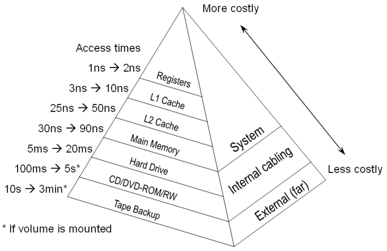
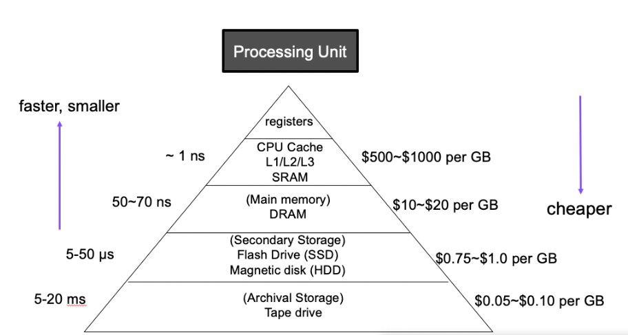
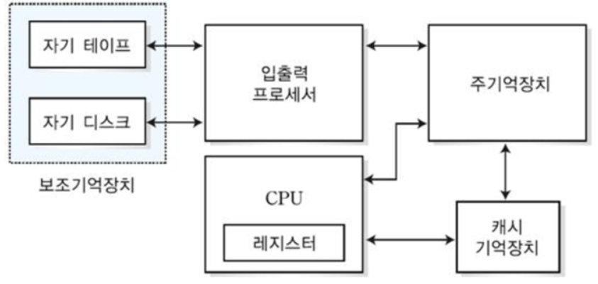
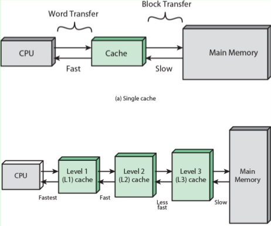
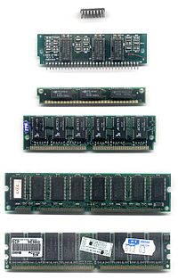

# 메모리 계층 구조 (Memory Hierarchy)

> 작성자 : 박리나

메모리 계층 구조 (Memory Hierarchy)

- [메모리 계층 구조]

---

### 메모리 계층 구조 (Memory Hierarchy)

메모리 계층 구조 (Memory Hierarchy) 란 메모리를 속도, 용량, 비용간의 절충 관계를 고려하여 필요에 따라 여러가지 종류로 나누어둠을 의미한다. 이때 필요란 대부분의 경우 CPU가 메모리에 더 빨리 접근하기 위함이다.

계층 구조에서 위쪽으로 올라갈수록 CPU 코어에 가까워지기 때문에 CPU가 메모리에 더 빨리 접근할 수 있지만, 그만큼 비용이 많이 들고 저장 용량은 적다.

계층 구조 아래쪽으로 내려갈수록 다음 내용이 성립한다.

- 비트당 비용 감소
- 용량 증가
- 접근 시간 증가 (속도 느림)
- 처리기에 의한 메모리 접근 회수 감소

- 레지스터와 캐시는 CPU 내부에 존재. CPU는 아주 빠르게 접근 가능
- 메모리는 CPU 외부에 존재. 레지스터와 캐시보다 더 느리게 접근 할 수 밖에 없다.
- 하드 디스크는 CPU가 직접 접근할 방법조차 없다. CPU가 하드 디스크에 접근하기 위해서는 하드 디스크의 데이터를 메모리로 이동 시키고 메모리에서 접근해야 한다. 아주 느린 접근 밖에 불가능

### 계층 종류와 특징

#### 1. 레지스터(Register)

- CPU 내부에 위치하며 가장 빠르지만 용량이 매우 작은 메모리
- 일반적으로 현재 계산을 수행중인 값을 저장하는 데 사용

- 개념

  - CPU 가 요청을 처리하는 데 필요한 데이터를 일시적으로 저장하는 기억 장치
    - CPU(Central Processing Unit) : 중앙처리 장치
      
    - 컴퓨터에서 4대 주요 기능(기억, 해석, 연산, 제어)을 관할하는 장치
    - CPU는 자체적으로 데이터를 저장할 방법이 없으므로 메모리로 직접 데이터를 전송할 수 없음
      - 연산을 위해서 반드시 레지스터를 거쳐야 하며, 이를 위해 레지스터는 특정 주소를 가리키거나 값을 읽어올 수 있음
  - 프로세서에 위치한 고속 메모리로, 프로세스가 바로 사용할 수 있는 데이터(소량의 데이터, 처리 중인 중간 결과 등)를 담고 있는 영역

- CPU 내부 레지스터 종류
  | 종류 | 설명 |
  | :-------------------------------------------------: | :---------------------------------------------------------------------------: |
  | 프로그램 계수기(PC, Program Counter) | 다음에 실행할 명령어(instruction)의 주소를 가지고 있는 레지스터 |
  | 누산기 (AC, ACcumulator) | 연산 결과 데이터를 일시적으로 저장하는 레지스터 |
  | 명령어 레지스터(IR, Instruction Register) | 현재 수행 중인 명령어를 가지고 있는 레지스터 |
  | 상태 레지스터(SR, Status Register) | 현재 CPU의 상태를 가지고 있는 레지스터 |
  | 메모리 주소 레지스터 (MAR, Memory Address Register) | 메모리로부터 읽어오거나 메모리에 쓰기 위한 주소를 가지고 있는 레지스터 |
  | 메모리 버퍼 레지스터 (MBR, Memory Buffer Register) | 메모리로부터 읽어온 데이터 또는 메모리에 써야할 데이터를 가지고 있는 레지스터 |
  | 입출력 주소 레지스터 (I/O AR, I/O Address Register) | 입출력 장치에 따른 입출력 모듈의 주소를 가지고 있는 레지스터 |
  | 입출력 버퍼 레지스터 (I/O BR, I/O Buffer Register) | 입출력 모듈과 프로세서 간의 데이터 교환을 위해 사용되는 레지스터 |

#### 2. 캐시 메모리(Cache Memory)

- CPU와 메인 메모리 사이에 위치하여 자주 사용되는 데이터의 접근 속도를 향상시키는 역할을 한다.
- 메모리 접근은 특정한 위치의 근방에서 자주 일어나는 경향이 있기 때문에, 데이터를 크기는 작지만 속도가 빠른 캐시 메모리에 복사해두면 평균 메모리 접근 시간을 단축시킬 수 있다.
- 여러 레벨(L1, L2, L3)이 있다.
  

- 프로세서가 메인 메모리를 읽거나 쓰고자 할 때 먼저 그 주소에 해당하는 데이터가 캐시에 존재하는지 확인한다. 만약 그 주소의 데이터가 캐시에 있으면 데이터를 캐시에서 직접 읽고, 그렇지 않으면 메인 메모리에 직접 접근한다.

- 개념

  - 데이터나 값을 미리 복사해 놓는 임시 장소
  - 시스템의 효율성을 위해 사용
    - 캐시의 접근 시간에 비해 원래 데이터를 접근하는 시간이 오래 걸리는 경우
    - 값을 다시 계산하는 시간을 절약하고 싶은 경우
  - 속도가 빠른 장치와 느린 장치 사이에서 속도차에 따른 병목 현상을 완화하기 위한 범용 메모리

  [캐싱(Caching)](https://m.blog.naver.com/complusblog/221204759836) : 캐시(Cache)라고 하는 좀 더 빠른 메모리 영역으로 데이터를 가져와서 접근하는 방식

- 종류

  - CPU 캐시
    - 대용량의 메인 메모리 접근을 빠르게 하기 위해 CPU 칩 내부나 바로 옆에 탑재하는 작은 메모리
    - 하드웨어를 통해 관리

  |  종류   |                                             설명                                             | CPU 성능에 직접적인 영향 |
  | :-----: | :------------------------------------------------------------------------------------------: | :----------------------: |
  | L1 캐시 |     일반적으로 CPU 칩 안에 내장되어 데이터 사용 및 참조에 가장 먼저 사용되는 캐시 메모리     |            O             |
  | L2 캐시 | - L1 캐시 메모리와 용도와 역할이 비슷   - 속도 : L1 캐시 > **L2 캐시** > 일반 메모리(RAM) |            O             |
  | L3 캐시 |       - L1 캐시, L2 캐시와 동일한 원리로 작동   - 대부분 CPU가 아닌 메인보드에 내장       |            X             |

  - **디스크 캐시**(=디스크 버퍼) : 하드 디스크에 내장된 '작은 컴퓨터'(기능 : 디스크 제어, 외부와의 인터페이스)가 소유한 '작은 메모리'(디스크에 입출력되는 데이터를 저장하는 작은 메모리)
    => 일종의 기법(하드 디스크와 RAM 사이에 존재)
  - **그 외**
    - 소프트웨어적으로 관리
    - 페이지 캐시 : 운영 체제의 메인 메모리를 하드 디스크에 복사해놓는 캐시
      e.g., 웹 브라우저의 웹 페이지 캐시

- 지역성
  - 데이터 접근이 시각적, 혹은 공간적으로 가깝게 일어나는 것
  - 캐시가 효율적으로 동작하기 위해서는 캐시가 저장할 데이터가 지역성을 가져야 함
  - 종류
    |종류|설명|
    |:---:|:---:|
    |시간적 지역성|특정 데이터가 한 번 접근되었을 경우, 가까운 미래에 또 한 번 데이터에 접근할 가능성이 높음|
    |공간적 지역성|액세스 된 기억 장소와 인접한 기억 장소가 액세스 될 가능성이 높음|

#### 3. 메인 메모리(Main Memory or RAM)

- 개념

  - 주 기억장치(= 1차 기억 장치)
  - 컴퓨터에서 수치•명령•자료 등을 기억하는 컴퓨터 하드웨어 장치

- 구성

  - RAM(Random Access Memory) : 휘발성 기억 장치
    - 컴퓨터가 빠른 액세스를 하기 위해 데이터를 단기간 저장하는 구성 요소
    - 사용자가 요청하는 프로그램이나 문서를 스토리지 디스크에서 메모리로 로드하여 각각의 정보에 액세스
    - 전원이 유지되는 동안 CPU의 연산 및 동작에 필요한 모든 내용이 저장
    - 전원 종료시 기억된 내용 삭제
    - Random Access
  - ROM(Read Only Memory) 고정 기억 장치
    - 컴퓨터에 지시사항을 영구히 저장하는 비휘발성 메모리
    - 전원 종료시 기억된 내용 유지
    - 변경 가능성이 희박한 기능 및 부품에 사용
      - 스프트웨어 : 초기 부팅 관련 부분
      - 하드웨어 : 프린터 작동에 관여하는 펌웨어 명령 등

- 프로그램 실행 중에 필요한 데이터와 명령어를 저장하는 곳으로, 접근 속도는 캐시보다 느리지만 용량이 크다.
- CPU에서 직접 접근이 가능한 메모리. 대표적으로 RAM과 ROM이 존재
  - RAM(Random Access Memory, 임의접근 기억장치)
     - 사용자가 자유롭게 내용을 읽고 쓰고 지울 수 있는 기억 장치. - 컴퓨터가 켜지는 순간부터 CPU는 연산을 하고 동작에 필요한 모든 내용이 전원이 유지되는 내내 이 기억 장치에 저장된다. - 전원이 꺼지면 기억된 내용이 모두 사라지는 휘발성 메모리 - RAM은 어느 위치에 저장된 데이터든지 접근(읽기 및 쓰기)하는데 동일한 시간이 걸리는 메모리라서 '랜덤(Random, 무작위)' 라는 명칭이 주어짐
  - ROM(Read Only Memory)
    - ROM은 기억된 내용을 읽을 수만 있는 기억 장치로써 일반적으로 쓰기는 불가능
    - 전원이 꺼져도 기억된 내용이 지워지지 않는 비 휘발성 메모리

#### 4. 보조 메모리(Secondary Storage)

- 하드 드라이브(HDD), 솔리드 스테이트 드라이브(SSD) 등이 여기에 속하며, 대용량 데이터를 저장하지만 접근 속도는 주 메모리보다 훨씬 느립니다.

- 개념

  - Hard Disk(하드 디스크), Hard Drive(하드 드라이브), Fixed Drive(고정 디스크)
  - 비휘발성, 순차 접근이 가능한 컴퓨터의 보조 기억 장치
  - 비휘발성 데이터 저장소 가운데 가장 대중적이며 용량 대비 가격이 가장 저렴

- 작동 원리

  - 보호 케이스 내부의 플래터를 회전 -> 플래터에 자기 패턴으로 정보 기록
  - 플래터 표면의 코팅된 자성체에 데이터 기록
  - 회전하는 플래터 위에 부상하는 입출력 헤드에 의해 자기적으로 데이터 기록 및 조회 가능

- 구성 요소
  |요소|설명|
  |:---:|:---:|
  |제어 회로| - 하드 디스크의 총괄적인 부분을 제어하는 회로  - 제어회로 내부의 버퍼 메모리는 하드 디스크에 입출력될 데이터를 임시 저장함 |
  |Spindle Motor(스핀들 모터)|플래터의 회전을 담당하는 부분|  
  |Platter(플래터)| - 데이터 기록 담당  - 하나의 하드디스크에 한 개 이상 장착  - 플래서 수↑ → 용량 저장 크기 ↑, 안정성 ↓ |
  |Actuator(액추에이터)|제어회로의 명령에 따라 액추에이터 암 구동 → 헤드가 원하는 데이터 조회 가능|
  |Actuator Arm(액추에이터 암)| 액추에이터를 통해 구동됨  - 하나의 디스크에 여러 개 달려 있음  - 암의 끝 부분에 입출력을 위한 헤드 달려 있음|
  |Head(헤드) | - 데이터를 읽고 쓰는 헤드 |

RAM = 휘발성 저장 장치
보조 기억 장치 = 비휘발성 저장 장치

### 메모리 계층 구조의 필요성

> CPU는 작은 메모리에 더 빨리 접근 가능하다

#### ✅디코딩(명령어 해독 단계) 속도

- Decoding(디코딩) : 복호화 라고도 하며, Encoding(부호화)된 정보를 Code(부호)화 되기 전으로 되돌리는 처리 혹은 그 처리 방식
- CPU는 3개의 버스를 통해 메모리에 접근함
  - 주소 전달 버스 : CPU가 메모리의 어느 부분의 데이터를 접근할 지 나타냄
  - 데이터 전달 버스 : 메모리와 CPU 간 데이터 전송
  - 컨트롤 신호 버스 : CPU의 메모리 접근 여부 표시
- 주소 전달 버스 및 데이터 전달 버스에 값이 존재하고 컨트롤 신호를 전송 -> CPU와 메모리 업무 수행
- 큰 메모리 용량을 사용할 경우 디코딩하는 데 더 많은 시간 소요됨
  **-> CPU가 빠르게 데이터에 접근하기 위해서는 데이터를 저장하는 메모리가 작아야 함**

#### ✅참조의 지역성(locality of reference)

프로그램은 일반적으로 많은 반복 루프와 서브 루틴을 포함하고 있다. 일단 루프나 서브 루틴으로 진입하면, 적은 수의 명령어 집단들이 반복해서 참조 된다.
따라서 자주 쓰일것 같은 데이터는 메모리에서 캐시로 읽어와서 메모리까지 가지 않고 한동안 캐시에서 해결이 가능하므로 시간을 단축시킨다.
전체 프로그램 중 일부 데이터를 집중 사용하는 것이기에 메모리 용량이 작아도 된다.

- 큰 메모리를 사용한다고 해도 그 안에 모든 데이터를 고르게 접근하지 않음
- **자주 쓰이는 데이터는 계속 자주 쓰이고, 자주 쓰이지 않는 데이터는 계속 자주 쓰이지 않음**
  => 운영체제•CPU -> 자동으로 자주 쓰이거나 쓰일 것 같은 데이터를 메모리에서 캐시로 읽어옴
- 자주 쓰이는 데이터는 전체 데이터 양에 비해 작은 양이므로 캐시는 메모리보다, 메모리는 하드디스크보다 더 작아도 됨

#### ✅경제성

- 메모리 구조에서 상층에 속할수록 더 비쌈
- 메모리 계층 구조의 모양이 피라미드인 이유

  - 비싼 하드웨어는 꼭 필요한 만큼의 크기만 사용
  - 싼 하드웨어를 넉넉한 크기만큼 사용

- 비용적인 측면
  - 레지스터, 캐시, 메모리, 하드 디스크는 하드웨어적으로 만들어지는 방법이 다를 때가 많다.
- 속도적인 측면
  - CPU와 가까이 있는 레지스터가 가장 빠르게 접근 가능하고 밑으로 내려갈수록 접근 속도 감소
- 자주 쓰이는 데이터 재사용 = 참조의 지역성(locality of reference)

  - 자주 쓰이는 데이터는 반복해서 쓰인다.

- https://brightstarit.tistory.com/14

- https://c4u-rdav.tistory.com/88

- https://velog.io/@yu-jin-song/CS-%EB%A9%94%EB%AA%A8%EB%A6%AC-%EA%B3%84%EC%B8%B5-%EA%B5%AC%EC%A1%B0
