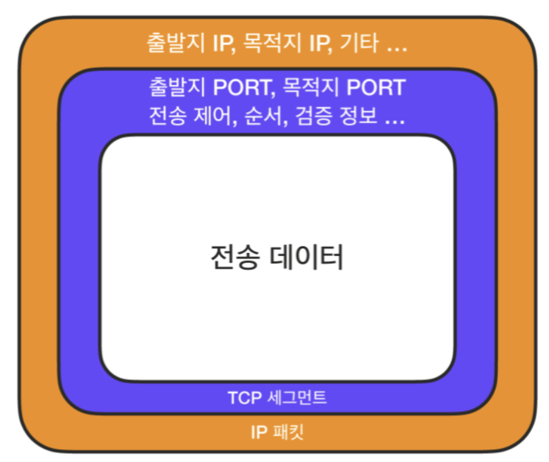
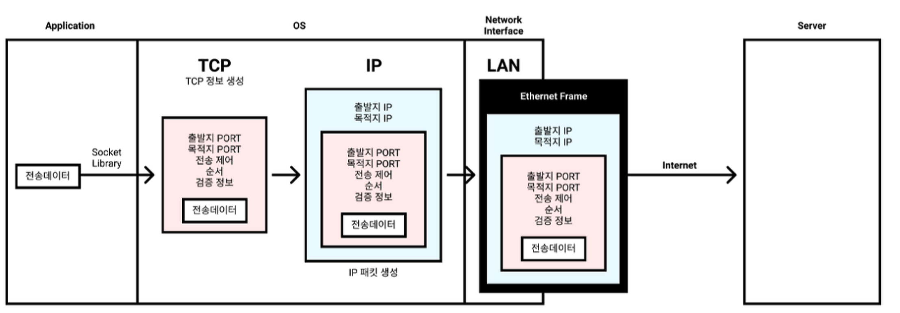
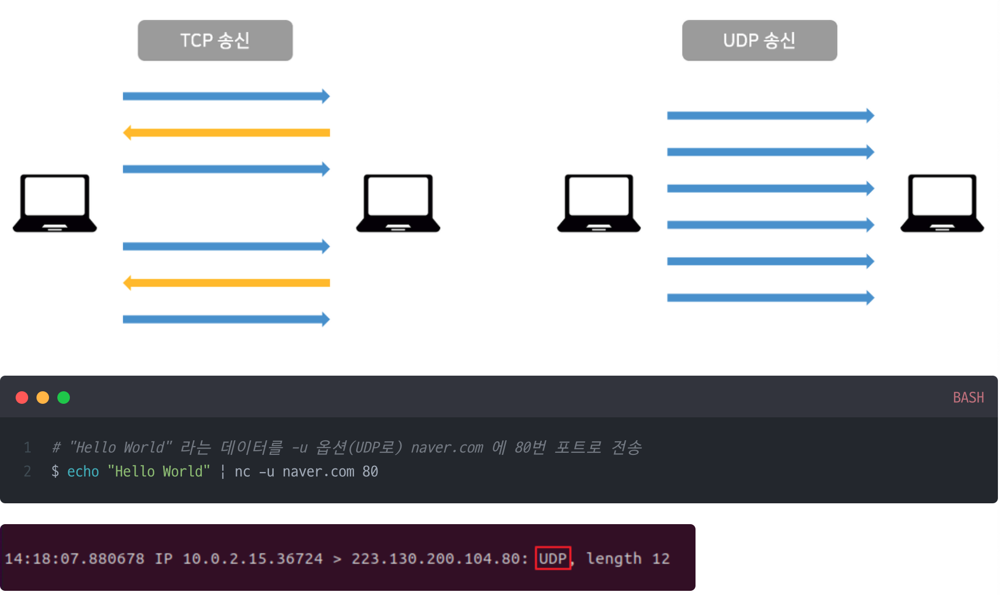

# TCP & UDP

> 작성자 : [배소라] (https://github.com/sorayayat)

목차

- [TCP](#tcp---전송-제어-프로토콜)
- [친절한 TCP](#tcp는-굉장히-친절한-프로토콜이다)
- [UDP](#udp---사용자-데이터그램-프로토콜)
- [UDP는 상프로토콜?!](#udp는-신뢰성이-없는게-아니다탑재를-안했을뿐)
- [참고자료](#참고자료)

---

프로토콜은 클라이언트와 서버가 정보를 교환할 수 있도록 하는 **메시지 형식에 대한 규칙**을 말한다.
예를들어 http 메세지 헤더도 결국 일종의 규칙이며, ip의 숫자도 규칙이라고 말할 수 있다.

## TCP - 전송 제어 프로토콜

IP가 인터넷 프로토콜로서 복잡한 인터넷 망 속에서 클라이언트와 서버 간에 통신을 할 수 있게 IP주소와 패킷과 같은 규칙을 통해 통신을 하게 되는 것이라면,
**TCP**(Transmission Control Protocol)는 IP 규칙으로만 통신하기에 부족하거나 불안정하던 여러 단점들(패킷 순서가 뒤바뀌거나 패킷 유실)을 커버해
패킷 전송을 제어하여 신뢰성을 보증하는 프로토콜로 보면 된다.
하지만 이 둘은 별개의 규칙이다 !!!
IP 규칙에 써있는대로 목적지까지 다다랐으면, TCP 규칙에 써있는대로 올바르게 도착했는지 정확히 누구에게 전달되야하는지 하나하나 따진다고 생각하면 된다. 그래서 은행 업무나 메일과 같은 반드시 수신자가 정보를 받아야하는 신뢰성 있는 통신이 필요할때 사용된다.

---

좀 더 와닿게 설명하자면 다음과 같다.

택배 수화물에 비유하면 IP는 단순한 주소라고 하면 TCP는 택배 스티커와 같이 자세한 정보가 기입되어있다.
주소로만 전송하기에 불안정한 부분을 TCP라는 세부정보를 통해서 배달하는 것이다.

1) 전송데이터를 TCP 포장한다.
2) 포장한 전송데이터를 IP 포장한다.
3) 포장한 전송데이터를 이더넷 포장한다.
4) 인터넷을 통해 상대 컴퓨터 서버에 도달하여 포장된걸 하나씩 풀며 전송 받게 된다.

---
### TCP는 굉장히 친절한 프로토콜이다.
꼼꼼하게 포장하여 배달까지 해준다.
신뢰성 프로토콜 답게, 목적지가 무사한지 미리 확인하고 배달이 끝나고도 확인해주는 굉장히 친절한 프로토콜이다.
**통신을 시작할 때와 종료할 때 서로 준비가 되어있는지를 반드시 미리 먼저 물어보고 패킷을 전송할 순서를 정하고 나서야 본격적인 통신을 시작하기 때문이다.**

이러한 과정을 3 Way Handshake와 4 Way Handshake 과정이라 한다.

둘다 똑같은 핸드쉐이크(Handshake)지만 3way는 통신을 시작할때, 4way는 마칠때 거치는 과정이라는 차이만 있다.
즉, 한번 통신하는데 핸드쉐이크를 두번 해서 신뢰가 과하게 보장 된다...!

|FLAG|설명|
|---|---|
|SYN|접속요청을 할 때 보내는 패킷을 말한다.TCP접속시에 가장먼저 보내는 패킷이다.|
|ACK|상대방으로부터 패킷을 받은 뒤에, 잘 받았다고 알려주는 패킷을 말한다. 다른 플래그와 같이 출력되는 경우도 있다.|
|PSH|데이터를 즉시 목적지로 보내라는 의미이다.|
|FIN|접속종료를 위한 플래그이 패킷을 보내는 곳이 현재 접속하고 있는 곳과 접속을 끊고자 할 때 사용한다.|

  

## UDP - 사용자 데이터그램 프로토콜

단순히 표를 본다면 tcp는 신뢰성이 높고 느리다 udp는 신뢰성이 낮고 빠르다 정도로 정리가 되어 보인다.

tcp는 핸드쉐이크 과정을 거치게 되기 때문에 데이터 하나를 전송하더라도 많은 밑작업을 거치게 된다.
빠른 통신을 위해 http 2.0에서 한번 연결된 tcp 회선을 길게 유지하고 데이터 스트림이라는 특수한 형태로 보내는 식으로 극복을 했지만 근본적인 특징 때문에 결과적으로 속도 한계가 있다.

반면, UDP(User Datagram Protocol)는 데이터크램 방식을 사용하는 프로토콜이기 때문에 애초에 각각의 패킷 간의 순서가 존재하지 않는 독립적인 패킷을 사용한다.

데이터 그램의 방식은 패킷의 목적지만 정해져있다면 중간경로는 어디든 신경쓰지 않기 때문에 핸드쉐이크 같은 연결이 필요가 없다!
그래서 UDP는 실시간 영상 스트리밍과 같은 고용량 데이터를 다루는 곳이 사용된다.

응답 패킷 없이 그냥 때려 보낸다.

## UDP는 신뢰성이 없는게 아니다..탑재를 안했을뿐

신뢰성 대신 속도를 택한 UDP는 신뢰성이 낮으니 TCP 기반 프로토콜을 더 많이 사용 할 것 같지만!!!!! 이는 명확하지 않다.

*UDP는 신뢰성을 탑재 하지 않았을 뿐*... 진짜 장점은 바로 이것이다.

**UDP는 커스터 마이징이 가능하다.**

UDP 자체는 헤더에 들은게 없어 신뢰성이 낮고 제어 기능도 없지만, 이 후 개발자가 애플리케이션에서 구현 하기에 따라서 TCP와 비슷한 수준을 가질 수 있다.

그래서 나온 것이 HTTP 3.0 !

UDP 기반으로 만들어진 QUIC(Quick UDP Internet Connections) 프로토콜을 채택하였다.

TLS(보안 프로토콜) 자체를 내포하고 있어 연결 설정에 필요한 정보와 함께 데이터도 보내버리기 때문이다.
한번 연결에 성공하면 서버는 해당 설정을 캐싱해놓고 있다가, 다음 연결때는 바로 사용하여 연결없이 바로 통신도 가능하다.

##### 참고자료
(https://inpa.tistory.com/entry/NW-%F0%9F%8C%90-%EC%95%84%EC%A7%81%EB%8F%84-%EB%AA%A8%ED%98%B8%ED%95%9C-TCP-UDP-%EA%B0%9C%EB%85%90-%E2%9D%93-%EC%89%BD%EA%B2%8C-%EC%9D%B4%ED%95%B4%ED%95%98%EC%9E%90#%F0%9F%94%8D_tcp_%ED%97%A4%EB%8D%94%EC%99%80_udp_%ED%97%A4%EB%8D%94_%ED%81%AC%EA%B8%B0_%EC%B0%A8%EC%9D%B4)